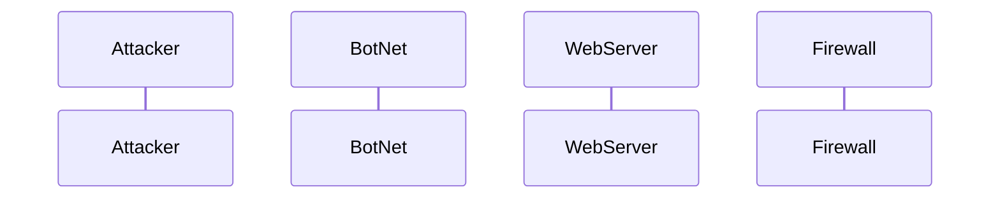

    Attacker->>BotNet: Command bots to attack WebServer
    BotNet->>WebServer: Flood WebServer with massive traffic (DDoS)
    WebServer->>Firewall: Alerts of abnormal traffic
    Firewall->>Firewall: Analyzes traffic patterns
    Firewall->>WebServer: Filters and blocks malicious traffic
    WebServer->>LegitimateUsers: Limited or delayed response due to overload
    Firewall-->>BotNet: Blocks malicious IP addresses
    Firewall->>Attacker: Attempts to trace origin of attack

##Step-by-Step Description of the DDoS Attack Sequence 

1. **Attacker commands the botnet** : The attacker sends instructions to the compromised bots (BotNet), commanding them to target the company’s web server with a Distributed Denial of Service (DDoS) attack.
  
2. **BotNet floods the WebServer**: The botnet, made up of numerous infected devices, begins sending excessive requests to the web server. The goal is to overwhelm the server with so much traffic that it cannot handle legitimate requests.

3. **WebServer detects abnormal traffic**: As the traffic from the botnet increases beyond normal limits, the web server alerts the firewall or other network defense systems about the possible DDoS attack.

4. **Firewall analyzes the traffic**: The firewall begins analyzing the incoming traffic patterns, trying to differentiate between legitimate requests and malicious requests from the botnet.

5. **Firewall blocks malicious traffic**: Once the firewall has identified malicious traffic, it filters and blocks requests from suspicious IP addresses associated with the botnet, trying to mitigate the effects of the attack.

6. **WebServer still experiences limited response**: Despite the firewall’s defense mechanisms, the server may still experience delays or intermittent service outages due to the sheer volume of traffic hitting it.

7. **Firewall blocks the BotNet**: The firewall continues its defense by blocking additional malicious IP addresses from the botnet to prevent further attacks.

8. **Firewall attempts to trace the Attacker**: In some cases, the firewall or security system may attempt to trace back the attack to the original attacker to gather information about the attacker's identity or source.
