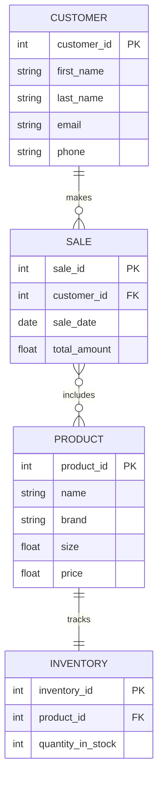

```markdown
## Entity Descriptions

1. **PRODUCT**: Represents various models of Nike shoes available for sale. Each product has a unique ID, name, brand, size, and price.

2. **CUSTOMER**: Contains information about customers who purchase products. Each customer is uniquely identified by a customer ID.

3. **SALE**: Captures transaction details, linking customers with the products they purchase. It includes the sale ID, customer ID, date of sale, and the total amount for the transaction.

4. **INVENTORY**: Monitors stock levels for each product. Each inventory entry is linked to a specific product through the product ID.

## Relationships

- **Customer makes Sale**: A single customer can make multiple sales. This relationship is represented as a one-to-many relationship (1 customer to many sales).
  
- **Sale includes Product**: A sale can include multiple products, and a product can be included in many sales. This is a many-to-many relationship, which is captured through a junction table in the diagram.

- **Product tracks Inventory**: Each product has a corresponding inventory record that tracks the quantity in stock. This is a one-to-one relationship.

These relationships support business operations by allowing the store to efficiently manage customer interactions, track sales, and maintain inventory levels, ensuring that popular products are restocked promptly.
```
